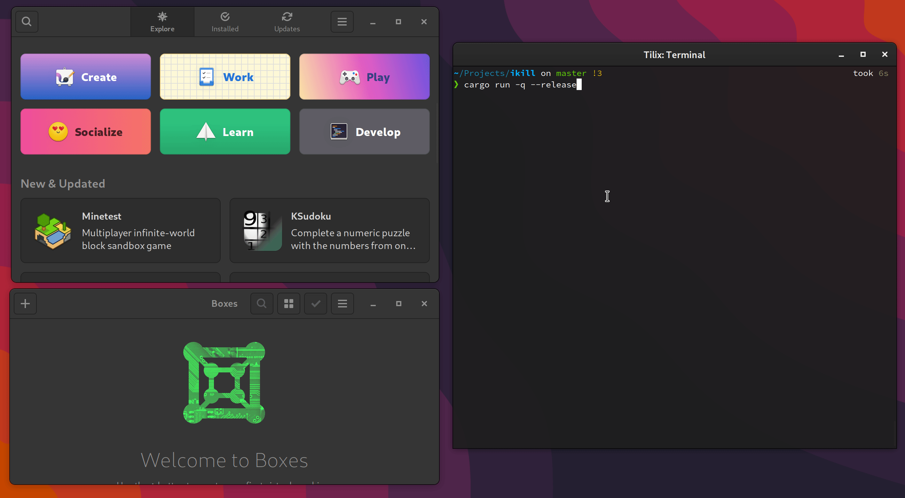

ikill [](https://crates.io/crates/ikill) 
---

> Interactively kill running processes, inspired by [fkill-cli](https://github.com/sindresorhus/fkill-cli).

### Features
- List and fuzzy find running processes.
- Multi select processes (by pressing <kbd>⭾</kbd>)

### Usage
Run `ikill` on terminal, search and press <kbd>↵</kbd>.

### Screenshot

[](./screencast.gif)

### Installation
```
cargo install ikill
```
### Usage

### TODO
 - [ ] Kill process by PID/name (without fuzzy finder).
 - [ ] Preview pane with process id?
